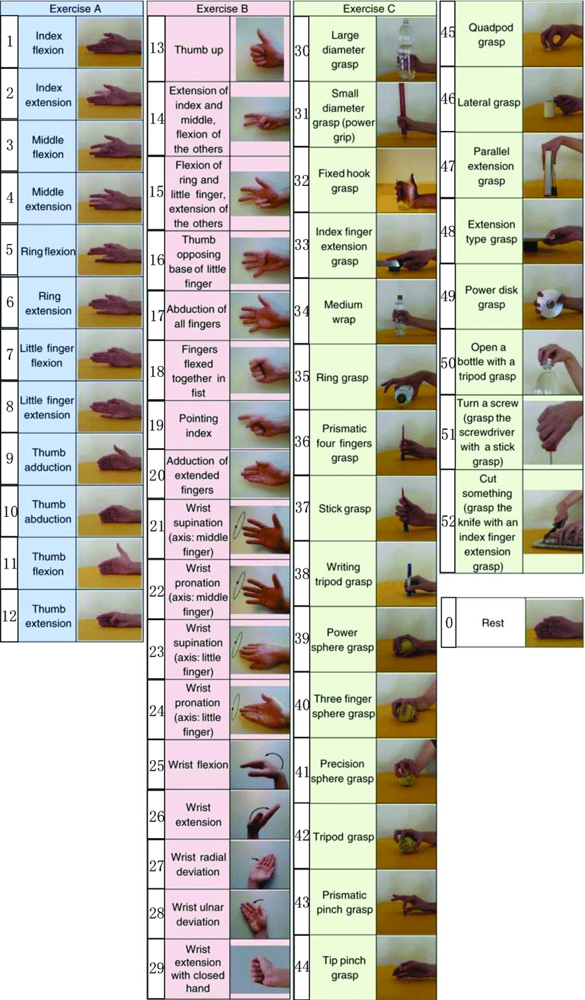
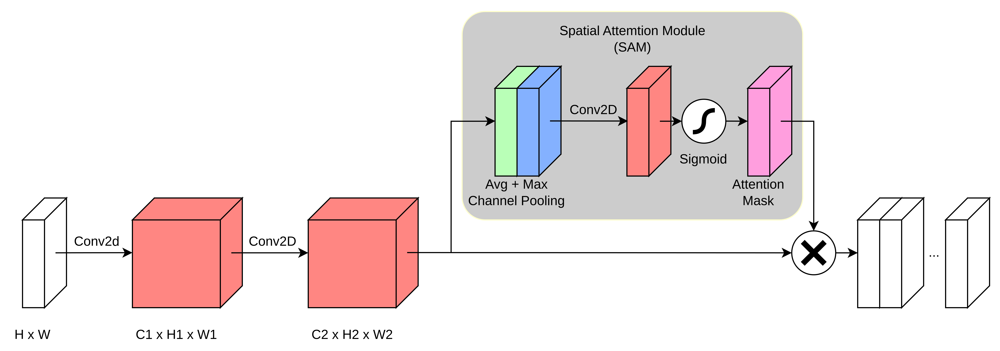

# 🧠 LightCBAM_HGR

Convolutional Block Attention Module for Hand Gesture recognition by sEMG.

## 📌 Project structure

```markdown
main/
│
├── checkpoints    # Weights from all trials
│ └── ...
│
├── emg_recorder
│ ├── data    # Real datasets
│ │ ├── continuous/
│ │ └── discrete/
│ ├── model_finetuned/    # Weights and standatrizaion parameters for best model
│ ├── notebooks/ 
│ │ ├── emg_analysis_continuous.ipynb    # FIXME
│ │ └── emg_analysis_discrete.ipynb    # Fine-tuning
│ ├── myo_serial.py    # Some script from pyomyo
│ ├── realtime.py    # Real-time inference
│ ├── record_emgs_contin.py
│ └── record_emgs_discrete.py
│
├── Ninapro_DB5/
│
├── normalization_values/    # Standartization parameters
│ └── *.json
│
├── reports/    # FIXME: plots
│
├── src
│ ├── `__init__.py`
│ ├── dataset.py    # Functions for parsing and preprocessing
│ ├── models.py    # All models
│ ├── train_kfold.py    # K-fold validation trials 
│ └── train.py    # FIXME: single model train
│
├── trial_scripts/    # Experimental trials
│
├── .gitignore
├── config_recorder.py    # EMG recorder app parameters
├── config.py    # Model and training hyperparameters
├── README.md
├── requirements.txt    # Model hyperparameters
└── utils.py    # Additional functions
```

## 🧪 Dependecies

- Python 3.10.12
- bleak 0.19.5
- Numpy 1.23.5
- Tensorflow 2.12.0
- MLFlow 3.1.1

Installation:

```python
pip install -r requirements.txt
```

## 🚀 Getting started 

Here is algorithm how to get fine-tuned model based on your own sEMG signals:

1) Obtain signals in two ways:

    1.1. Run `record_emgs_discrete.py` to collect `N` arrays of the gestures. For example if you run `python record_emgs_discrete.py --gesture 0` you would collect signals for the rest.

    1.2. Run `record_emgs_contin.py` to collect the continuous array of the gestures.

>[!IMPORTANT]
>It's recommended to use the first option.

2) Then run the appropriate notebook in `emg_recorder/notebooks/` to fine-tune the baseline model. Also you can check the performance.

3) Finally, run `realtime.py`.

## 📊 Dataset description

DB5 - this Ninapro dataset includes sEMG and kinematic data from 10 intact subjects while repeating 52 hand movements plus the rest position.
The dataset is described in detail in the following scientific paper:

[Pizzolato et al., Comparison of six electromyography acquisition setups on hand movement classification tasks, PLOS One, 2017](https://pubmed.ncbi.nlm.nih.gov/29023548/)

There are 9 gestures and 10 subjects in dataset for training. The set of the gestures consist of:

- `0` - Rest  
- `13` - Thumb up
- `15` - Flexion of ring and little finger, extension of the others
- `18` - fingers flexed together in fist
- `19` - Pointing index
- `34` - Medium wrap
- `38` - Writing tripod grasp
- `43` - Prismatic pinch grasp
- `46` - Lateral grasp



## 📦 Model

The model is a lightweight 2D convolutional neural network designed for classifying surface EMG signals into predefined hand gestures.

It takes a sliding window of **`WINDOW_SIZE` samples from 8 EMG channels** as input. To improve spatial and channel-wise feature selection, the model incorporates a **Spatial Attention Module (SAM)** after convolutional encoder.

The Spatial Attention Module focuses on "where" the most informative features are located by generating a spatial attention map. It complements channel attention by emphasizing important regions along the temporal or spatial dimensions of the feature map.

The final classification layer outputs softmax probabilities across the gesture classes.

Training is performed using the **categorical cross-entropy loss** and the **Adam optimizer**, with real-time logging via MLflow.

### Structure

- **Base model**: Convolutional block `ConvBlock` consists of `Conv2d() →  BatchNorm2d(...) → PReLU → Dropout2d(...) → MaxPool2d(...)`.

- **Attention model**: $M_s(F) = σ(Conv3x3([AvgPool(F); MaxPool(F)]))$.



## Commits description

```markdown

feat: new feature

fix: bugs

docs: documentation, description

refactor: refactoring

chore: dependency update, build

```

## License

This project is licensed under the terms of the GNU General Public License v3.0 (GPLv3).  
You are free to use, modify, and distribute this code, but any derivative work must also be open-sourced under the same license.  
See the [LICENSE](./LICENSE) file for full license text.
